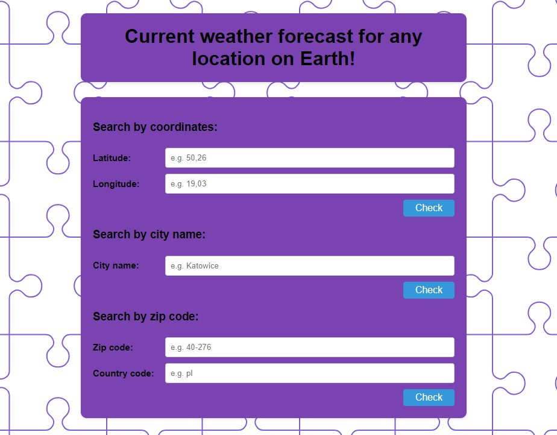
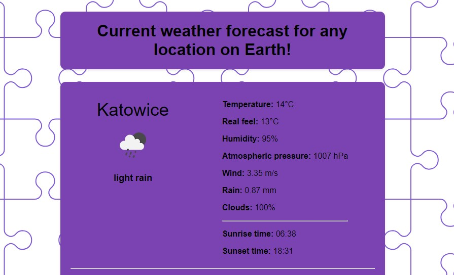

# Web Development Bootcamp - Capstone-Project-3_Public-API

A simple website using the Express/Node.js platform, with Axios HTTP client, that integrates a public API - in my case public OpenWeather API.
The website interact with the chosen API, retrieve data and present it in a user-friendly manner.

## Table of contents

- [Overview](#overview)
  - [Screenshot](#screenshot)
  - [How to start](#how-to-start)
- [My process](#my-process)
  - [Built with](#built-with)
  - [Useful resources](#useful-resources)

## Overview

### How to start

- create an account on https://openweathermap.org/ and get an API key,
- use e.g. Visual Studio Code,
- fill the API_KEY variable,
- run command to install dependencies -> npm i,
- run command to install nodemon globally on the PC -> npm i -g nodemon,
- run command -> nodemon index.js,
- website is running on localhost, so open a web browser and run http://localhost:3000/

### Screenshot

- Home page:

- Weather information received:

## My process

### Built with

- Node.js project using Express.js,
- include Axios for making HTTP requests,
- include EJS for templating,
- user-friendly GUI - HTML and CSS.

### Useful resources

- [Web Development Bootcamp](https://www.udemy.com/course/the-complete-web-development-bootcamp/?couponCode=KEEPLEARNING)
- [Express.js documentation](https://expressjs.com/)
- [Node.js documentation](https://nodejs.org/docs/latest/api/)
- [Axios documentation](https://axios-http.com/docs/intro)
- [public OpenWeather API](https://openweathermap.org/)
